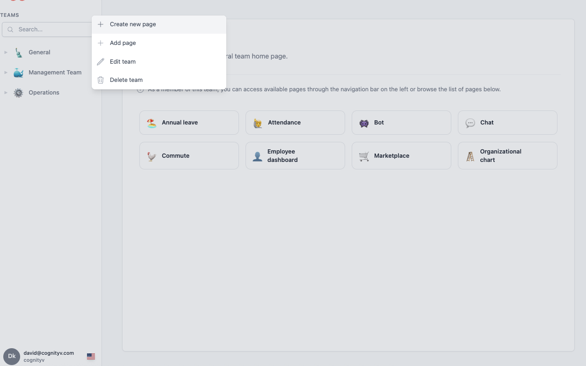
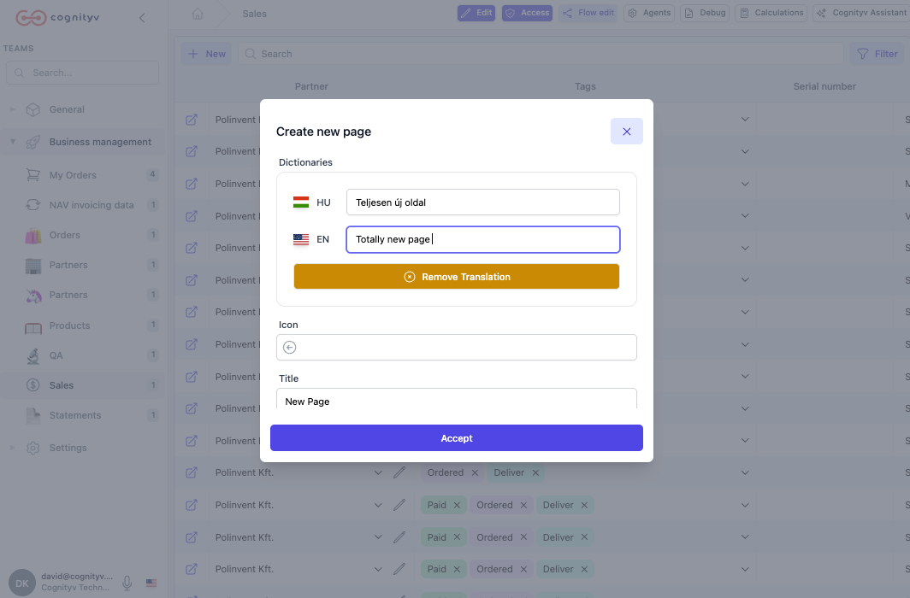
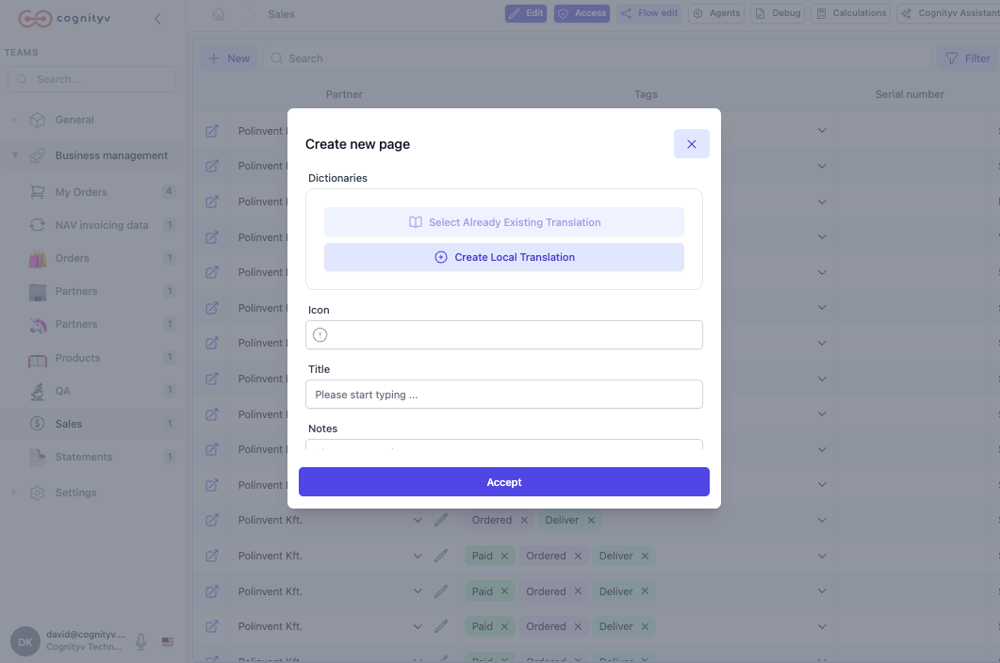
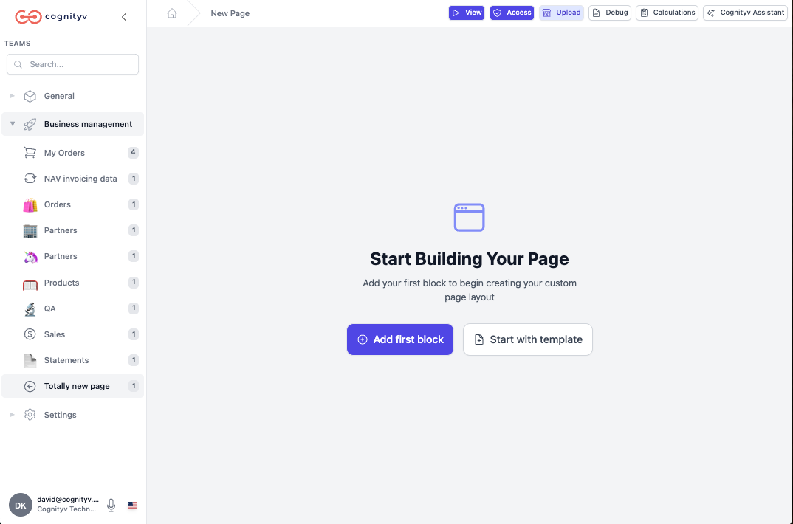

# Create New Page

This guide provides a complete walkthrough for creating new pages in the Cognityv Page Editor. Pages serve as custom interfaces for business processes and are organized within teams for proper access control.

---

## Prerequisites

### Administrative Access
- You must have **admin user privileges** to create new pages
- Standard users cannot create pages but can access pages based on team membership
- Ensure you understand the team structure before proceeding

### Team Planning
- Identify the **target team** where the page will be created
- Understand the team's purpose and current members
- Consider how the new page fits into existing business workflows
- Plan the page's data requirements and user interactions

---

## Step-by-Step Page Creation

### Step 1: Navigate to Team Management
1. **Locate the target team** in the navigation sidebar (e.g., "Sales" team)
2. **Hover over the team name** to reveal available actions
3. **Click the three dots (⋯) menu button** that appears
4. A dropdown menu will display team management options

*The dropdown menu includes options for "Create new page", "Add page", "Edit team", and "Delete team".*

### Step 2: Initiate Page Creation
1. From the dropdown menu, select **"Create new page"**
2. A modal dialog will appear for page configuration
3. The system will prepare the page creation interface

### Step 3: Configure Page Details

The page creation modal requires several configuration options:

#### Required Information
- **Dictionaries**: Configure translation and language settings
- **Icon**: Choose an optional icon to represent the page
- **Title**: Enter a descriptive name for the page
- **Notes**: Add optional description or implementation notes

#### Translation Configuration
The system supports multilingual pages with Hungarian (HU) and English (EN) translations:

- **Existing Translation**: Select from previously created translation dictionaries
- **Local Translation**: Create page-specific translations
- **Language Support**: Configure which languages the page will support

#### Best Practices for Configuration
- **Use descriptive titles** that clearly indicate the page's purpose
- **Select appropriate icons** that help users identify the page quickly
- **Plan translation needs** early to ensure consistent multilingual support
- **Document the page purpose** in the notes field for future reference

### Step 4: Save and Create
1. **Review all entered information** for accuracy
2. **Click "Accept"** to create the page
3. **Wait for system processing** - the page creation may take a few moments
4. **Confirm successful creation** when the modal closes

### Step 5: Access the New Page
1. The new page will appear in the team's page list immediately
2. Navigate to the page through the team structure in the sidebar
3. The page will initially display as empty with setup options

### Step 6: Begin Page Construction

Once created, the new page displays the "Start Building Your Page" interface with two primary options:

#### Option 1: Add First Block
- Start building with individual components
- Provides maximum flexibility for custom layouts
- Ideal for unique business requirements
- Allows step-by-step component addition

#### Option 2: Start with Template
- Use pre-built templates for common scenarios
- Faster implementation for standard business processes
- Templates include layouts for data entry, reporting, and workflows
- Can be customized after initial template application

